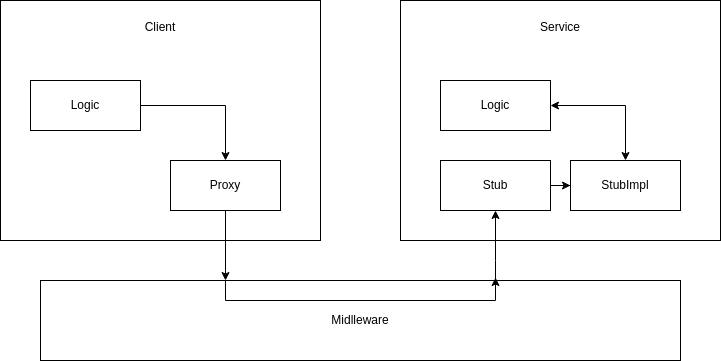
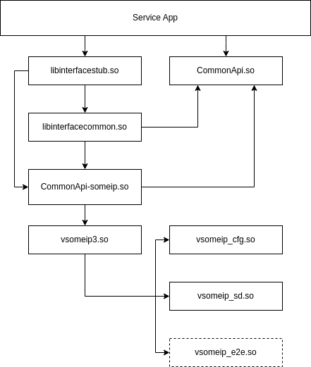
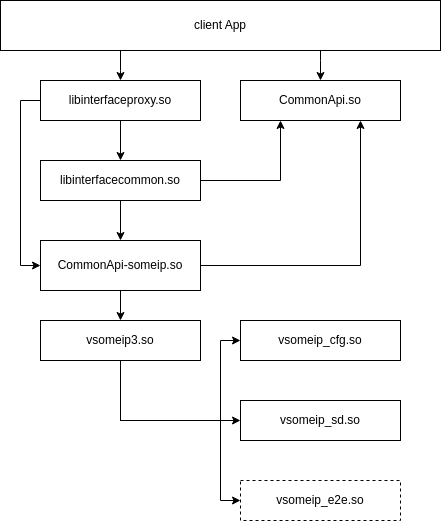

# SomeIP through CommonAPI

Using Common API unifies the interface used by the application regardless the middleware protocol.

For more details Please refer to [CommonAPI Official Repo](https://github.com/COVESA/capicxx-core-runtime) and [CommonAPI C++ Documentation](https://covesa.github.io/capicxx-core-tools/)

**Disclaimer**: This is just a more organized and simplified environment to practice development using CommonAPI. The original complete flow can be found in [COVESA CommonAPI 10-minute tutorials](https://github.com/COVESA/capicxx-core-tools/wiki). I've set-up this environment for personal use. So, it's not guaranteed to meet your needs but it's open source so feel free to modify according to your needs.

**Note**: The HelloWorld project is supposed work out-of-the-box if the all the dependencies are present and should be considered as a golden example. It's recommended to do a dry-run on HelloWorld first to make sure the environment is setup correctly and get a grasp of how the environment is organized.

## Dependencies
- Packages: 
    - system tools
        ```
        $ sudo apt-get update
        $ sudo apt-get install -y git wget unzip
        ```
    - Java 8 and other tools. please refer to [this](https://github.com/COVESA/capicxx-dbus-tools/wiki/CommonAPI-C---D-Bus-in-10-minutes#step-1-preparation--prerequisites)
    - Boost Library
        ```
        $ sudo apt-get update
        $ sudo apt-get install -y libboost-all-dev
        ```
- Sources:
    - CommonAPI-core-runtime
    - CommonAPI-someip-runtime
    - vsomeip
- Code Generation Tools:
    - CommonAPI-core-tools
    - CommonAPI-someip-tools


## Common API Architecture 

~~~
+---------------------------------------+
|                  App                  |     
+---------------------------------------+

+-----------+   +-----------------------+
|           |   |                       |
|           |   |     CommonAPI Core    |
|           |   |     Generated Code    |
|           |   |                       |
|           |   +-----------------------+
|           +-----------+   +-----------+
|    CommonAPI Core     |   |           |
|        runtime        |   |           |
+-----------------------+   | CommonAPI |
                            |  Binding  |
+-----------------------+   |           |
|                       |   | generated |
|   CommonAPI Binding   |   |    code   |
|         Runtime       |   |           |
|                       |   |           |
+-----------------------+   +-----------+

+---------------------------------------+
|               IPC Stack               |
+---------------------------------------+
~~~

The common API library consists of two levels of abstractions:
- Core
- Binding

**Core**:
It implements part the APIs that's used directly by the application, I has no middleware-related information

**Binding**:
It contains all the middleware-related information in its implementation, but from the user perspective it's the same API for whatever middleware.

## Environment Setup 
It's very easy, after cloning this repo all you need to do is to run:
```
CommonAPI-Projects$ source envsetup.sh
```
If you feel stuck just run `nowWhat` anywhere:
```
CommonAPI-Projects$ nowWhat

Are you stuck? here's what you can do

General:
    workOn <project>        Setup the project work directory     
    goToRoot                Go to the environment root directory
    goToProject             Jump to the project directory

Project:
    genCoreApiFiles         Generate CommonApi files, fidl and fdepl files are expected to be under projectName/fidl
    buildProject            Build the current project
    runApp <target> cfg.ini Runs the target (Client or Service) app with the specified cfg.ini, 
                            if cfg.ini not specified projectName/commonapi4someip.ini will be used

Dependencies:
    cloneDeps               Clone dependencies under deps
    buildDeps               Build all dependencies
    buildCapi-core          Build only capi-core-runtime lib and install it to install_folder
    buildCapi-someip        Build only capi-someip-runtime lib and install it to install_folder
    buildVsomeip            Build only vsomeip libs and install it to install_folder

Code Generators:
    getGenTools             Download and extract the code generators
```
## Build Steps
- Set it and forget it
    1. Clone the dependencies
        - `cloneDeps`
    2. Build dependencies
        - `buildDeps`
    3. Get the code generation tools
        - `getGenTools`

- Per project steps
    1. Define your interface
    2. Generate CommonApi files
    3. Write your CMake rules
    4. Write your logic
    5. Write your configuration 
    6. Build and test

# Let's get our hands dirty

**IT'S HIGHLY RECOMMENDED THAT YOU'RE FAMILIAR WITH THE WORKFLOW OF COMMONAPI DEVELOPMENT OR AT LEAST SOME/IP AND TRIED THE TUTORIALS FROM COVESA [HERE](https://github.com/COVESA/capicxx-core-tools/wiki)**

## 1. Define your interface
First, let's have a simple interface with only one method `SayHello` that takes a string argument `name` and returns a string value `message`. 

For that CommonAPI uses Franca IDL to have a stable, versioned API

**NOTE**: franca files need to be under project/fidl so it can be detected.

### Franca Interface Definition Language (fidl)

This file has the interface specs that will be parsed by the core and binding generators in order to generate the core and glue code.
~~~
package commonapi.examples

interface HelloWorld {
    version { major 0 minor 1 }

    method sayHello {
        in {
            String name
        }
        out {
            String message
        }
    }
}
~~~
**package** is part of the interface identifier

**interface** an interface inside that package 

**version** the version of this interface instance, different versions could co-exist 

**method** a method inside this interface

**in** input parameters

**out** output parameters

Types can be found in 5.1.1 of [franca specs document](FrancaUserGuide-0.12.0.1.pdf).

Now, our interface is ready to be used by the core runtime generator, but if you're familiar with someip you'll notice that there are some missing information that's needed by both the service and its clients (i.e. , service id, instance id, method id, ...etc) that's where the deployment file comes in useful. So, let's do it!

### Franca dependency file (fdepl)
In this file we need to first define the specs by which we will parse this dependency file, we will use CommonAPI-4-SOMEIP_deployment_spec.fdepl which can be found [here](https://github.com/COVESA/capicxx-someip-tools/blob/master/org.genivi.commonapi.someip/deployment/CommonAPI-4-SOMEIP_deployment_spec.fdepl)

Don't worry, the generator will understand that path.

Then, we need to import the fidl file so we can define the deployment details of the interface

After that, we will specify our deployment detail based on the specs.

~~~
import "platform:/plugin/org.genivi.commonapi.someip/deployment/CommonAPI-4-SOMEIP_deployment_spec.fdepl"
import "HelloWorld.fidl"

define org.genivi.commonapi.someip.deployment for interface commonapi.examples.HelloWorld {
    SomeIpServiceID = 4660

    method sayHello {
        SomeIpMethodID = 30000
        SomeIpReliable = true

        in {
            name {
                SomeIpStringEncoding = utf16le
            }
        }
    }
}

define org.genivi.commonapi.someip.deployment for provider as Service {
    instance commonapi.examples.HelloWorld {
        InstanceId = "commonapi.examples.HelloWorld"

        SomeIpInstanceID = 4660

        SomeIpUnicastAddress = "192.168.7.2"
        SomeIpReliableUnicastPort = 30499
        SomeIpUnreliableUnicastPort = 30499
    }
}
~~~

as you can see we have two main parts of the deployment, one for the interface identification details and another one for the service discovery details. These details will be used later in the vsomeip.json configurations.


## 2. Generate CommonApi files
Once, we write our fidl and fdepl files we can generate the CommonAPI runtime core and binding code (**Only someip is supported**).    

### First we need to select a project.
```
CommonAPI-Projects$ workOn HelloWorld
```
Of course you can use whatever project name you'll be working on.   
**NOTE**: This name must match the project name in *CMakeLists.txt* file
   
### Now we can generate the CommonAPI files
This can be done by simply running:
```
CommonAPI-Projects$ genCoreApiFiles
```
It's expected to see the following directory structure
```
CommonAPI-Projects/
└───YourProjectName
    └───src-gen
        ├───core
        |   ├───common
        |   ├───proxy
        |   ├───skel
        |   └───stub
        └───someip
            ├───common
            ├───proxy
            └───stub

```
## 3. Write your CMake rules
It might be confusing at the beginning but it will make sense shortly, so bear with me. 

**Please use the same CMake variables and semantics in [CMakeLists.txt](HelloWorld/CMakeLists.txt) unless you know what you are doing.**

If you're not familiar with the Proxy-Stub pattern, her's a very simple yet abstracted overview:


**Client**: used a proxy object provided by the middleware to interact with the service

**Service**: uses a stub object to expose its implementation to the middleware

**Middleware**: connects the stub with the proxy via IPC 

**What do we need from Cmake?**     
We need the following:
- Executables:
    - Client App
    - Service App
- Shared Libs
    - Common
    - Stub
    - Proxy

**Why all these shared libraries?**     
Think about this scenario:
- The Service on your host machine which runs linux on an X86_64 target.
- The client is a raspberryPi which runs Android on arm64 target.

Drew an image in your mind? now look at this simple diagram and re-think the scenario again.




Now can you decide which parts do you need on your host and which ones you need on the target?

A client doesn't need to know about the stub and its implementation.

A service doesn't need to know about the proxy and its implementation.

Now, we can confidently write our CMakeLists! you can have a look at this [CMakeLists.txt](HelloWorld/CMakeLists.txt) as a reference.
   
## 4. Write your logic

Now, we have all we need to write our logic you can have a look at the HelloWorld/src [directory](HelloWorld/src/). Of course you can organize the src files as you wish as long as you'll reflect that organization in cmake.

It contains the following files:

- HelloWorldClient.cpp
    - Client logic
- HelloWorldService.cpp
    - Service Logic
- HelloWorldStubImpl.cpp
    - Implementation details of the stub/interface logic
- HelloWorldStubImpl.hpp
    - Implementation Specs of the stub/interface

## 5. Write your configuration 

We are one step away of running our app (please refer to [here](https://github.com/COVESA/capicxx-someip-tools/wiki/CommonAPI-C---SomeIP-in-10-minutes#step-6-build-and-run) for more details on the configuration)

We first need to define our commonapiConfig.ini, where we define:

- Default binding middleware
- Logging
- Proxy and Stub Libraries

You can have a look at [commonapi4someip.ini](HelloWorld/commonapi4someip.ini) for refernce .

for proxy and stub libraries config details have look at `commonapi.ini` section [here](https://github.com/COVESA/capicxx-core-tools/wiki/Loading-Bindings-And-Libraries#generate-code-and-create-an-adapted-cmake-file)

## 6. Build and test

Ready? It's also simple (assuming you followed the same pattern in [CMakeLists.txt](HelloWorld/CMakeLists.txt)), all you need to do is to run:
```
CommonAPI-Projects$ buildProject
CommonAPI-Projects$ runApp Service commonapi4someip.ini
```
you should see output similar to:
```
[CAPI][DEBUG] Adding proxy mapping: local:commonapi.examples.HelloWorld:v0_1:commonapi.examples.HelloWorld --> libHelloWorldsomeipproxy.so
[CAPI][DEBUG] Adding stub mapping: local:commonapi.examples.HelloWorld:v0_1:commonapi.examples.HelloWorld --> libHelloWorldsomeipstub.so
[CAPI][INFO] Loading configuration file /etc//commonapi-someip.ini
[CAPI][INFO] Loading configuration file 'commonapi4someip.ini'
[CAPI][INFO] Using default binding 'someip'
[CAPI][INFO] Using default shared library folder '/usr/local/lib/commonapi'
[CAPI][DEBUG] Added address mapping: local:commonapi.examples.HelloWorld:v0_1:commonapi.examples.HelloWorld <--> [1234.1234(0.1)]
[CAPI][INFO] Registering function for creating "commonapi.examples.HelloWorld:v0_1" stub adapter.
[CAPI][DEBUG] Loading library for local:commonapi.examples.HelloWorld:v0_1:commonapi.examples.HelloWorld stub.
[CAPI][DEBUG] Loading interface library "libHelloWorldsomeipstub.so" succeeded.
[CAPI][INFO] Registering stub for "local:commonapi.examples.HelloWorld:v0_1:commonapi.examples.HelloWorld"
2025-05-01 20:26:34.453511  [info] Parsed vsomeip configuration in 0ms
2025-05-01 20:26:34.453779  [info] Configuration module loaded.
2025-05-01 20:26:34.453815  [info] Security disabled!
2025-05-01 20:26:34.453839  [info] Initializing vsomeip (3.5.5) application "service-sample".
2025-05-01 20:26:34.454837  [info] Instantiating routing manager [Host].
2025-05-01 20:26:34.455479  [info] create_routing_root: Routing root @ /tmp/vsomeip-0
2025-05-01 20:26:34.455893  [info] Service Discovery enabled. Trying to load module.
2025-05-01 20:26:34.457369  [info] Service Discovery module loaded.
2025-05-01 20:26:34.457600  [info] Application(service-sample, 1000) is initialized (11, 100).
2025-05-01 20:26:34.459009  [info] Starting vsomeip application "service-sample" (1000) using 2 threads I/O nice 0
2025-05-01 20:26:34.459407  [info] rmi::offer_service added service: 1234 to pending_sd_offers_.size = 1
2025-05-01 20:26:34.459501  [info] routing_manager_stub::on_offer_service: ON_OFFER_SERVICE(1000): [1234.1234:0.1]
2025-05-01 20:26:34.459794  [info] create_local_server: Listening @ /tmp/vsomeip-1000
2025-05-01 20:26:34.459892  [info] Client [1000] routes unicast:127.0.0.1, netmask:255.255.255.0
2025-05-01 20:26:34.459984  [info] OFFER(1000): [1234.1234:0.1] (true)
Successfully Registered Service!
Waiting for calls... (Abort with CTRL+C)
2025-05-01 20:26:34.460542  [info] shutdown thread id from application: 1000 (service-sample) is: 7566748dc6c0 TID: 372396
2025-05-01 20:26:34.460638  [info] main dispatch thread id from application: 1000 (service-sample) is: 7566750dd6c0 TID: 372395
2025-05-01 20:26:34.461248  [info] Watchdog is disabled!
2025-05-01 20:26:34.461683  [info] io thread id from application: 1000 (service-sample) is: 7566758de6c0 TID: 372394
2025-05-01 20:26:34.462498  [info] io thread id from application: 1000 (service-sample) is: 756666ffd6c0 TID: 372399
2025-05-01 20:26:34.463548  [info] vSomeIP 3.5.5 | (default)
2025-05-01 20:26:34.465484  [warning] Network interface "lo" state changed: up
2025-05-01 20:26:34.467731  [info] Retrying netlink route request
2025-05-01 20:26:34.468319  [info] Retrying netlink route request
Waiting for calls... (Abort with CTRL+C)
2025-05-01 20:26:44.465237  [info] vSomeIP 3.5.5 | (default)
```

In another terminal run:
```
CommonAPI-Projects$ source envsetup.sh
CommonAPI-Projects$ workOn HelloWorld
CommonAPI-Projects$ runApp Client commonapi4someip.ini
```
you should see output similar to:
```
[CAPI][DEBUG] Adding proxy mapping: local:commonapi.examples.HelloWorld:v0_1:commonapi.examples.HelloWorld --> libHelloWorldsomeipproxy.so
[CAPI][DEBUG] Adding stub mapping: local:commonapi.examples.HelloWorld:v0_1:commonapi.examples.HelloWorld --> libHelloWorldsomeipstub.so
[CAPI][INFO] Loading configuration file /etc//commonapi-someip.ini
[CAPI][INFO] Loading configuration file 'commonapi4someip.ini'
[CAPI][INFO] Using default binding 'someip'
[CAPI][INFO] Using default shared library folder '/usr/local/lib/commonapi'
[CAPI][DEBUG] Added address mapping: local:commonapi.examples.HelloWorld:v0_1:commonapi.examples.HelloWorld <--> [1234.1234(0.1)]
[CAPI][VERBOSE] Registering function for creating "commonapi.examples.HelloWorld:v0_1" proxy.
[CAPI][DEBUG] Loading library for local:commonapi.examples.HelloWorld:v0_1:commonapi.examples.HelloWorld proxy.
[CAPI][DEBUG] Loading interface library "libHelloWorldsomeipproxy.so" succeeded.
[CAPI][VERBOSE] Creating proxy for "local:commonapi.examples.HelloWorld:v0_1:commonapi.examples.HelloWorld"
2025-05-01 20:26:58.023518  [info] Parsed vsomeip configuration in 0ms
2025-05-01 20:26:58.023792  [info] Configuration module loaded.
2025-05-01 20:26:58.023834  [info] Security disabled!
2025-05-01 20:26:58.023864  [info] Initializing vsomeip (3.5.5) application "client-ample".
2025-05-01 20:26:58.023988  [info] Instantiating routing manager [Proxy].
2025-05-01 20:26:58.024166  [info] Client [ffff] is connecting to [0] at /tmp/vsomeip-0 endpoint > 0x58536a6163b0
2025-05-01 20:26:58.024288  [info] Application(client-ample, ffff) is initialized (11, 100).
Checking Availability...
2025-05-01 20:26:58.026050  [info] Starting vsomeip application "client-ample" (ffff) using 2 threads I/O nice 0
2025-05-01 20:26:58.026802  [info] main dispatch thread id from application: ffff (client-ample) is: 7d27e79436c0 TID: 372748
2025-05-01 20:26:58.027556  [info] io thread id from application: ffff (client-ample) is: 7d27e81446c0 TID: 372747
2025-05-01 20:26:58.027707  [info] assign_client: (ffff:client-ample)
2025-05-01 20:26:58.027616  [info] io thread id from application: ffff (client-ample) is: 7d27e69416c0 TID: 372750
2025-05-01 20:26:58.027640  [info] shutdown thread id from application: ffff (client-ample) is: 7d27e71426c0 TID: 372749
2025-05-01 20:26:58.030012  [info] create_local_server: Listening @ /tmp/vsomeip-1001
2025-05-01 20:26:58.030161  [info] Client 1001 (client-ample) successfully connected to routing  ~> registering..
2025-05-01 20:26:58.030211  [info] Client 1001 Registering to routing manager @ vsomeip-0
2025-05-01 20:26:58.033731  [info] Application/Client 1001 (client-ample) is registered.
2025-05-01 20:26:58.127347  [info] ON_AVAILABLE(1001): [1234.1234:0.1]
Available!
2025-05-01 20:26:58.128252  [info] emb::find_or_create_local: create_client 1000
2025-05-01 20:26:58.128407  [info] Client [1001] is connecting to [1000] at /tmp/vsomeip-1000 endpoint > 0x58536a619e70
[CAPI][DEBUG] Message sent: SenderID: 4660 - ClientID: 4097, SessionID: 1
Got message: 'Hello world!'
[CAPI][DEBUG] Message sent: SenderID: 4660 - ClientID: 4097, SessionID: 2
Got message: 'Hello world!'
[CAPI][DEBUG] Message sent: SenderID: 4660 - ClientID: 4097, SessionID: 3
Got message: 'Hello world!'
[CAPI][DEBUG] Message sent: SenderID: 4660 - ClientID: 4097, SessionID: 4
Got message: 'Hello world!'
[CAPI][DEBUG] Message sent: SenderID: 4660 - ClientID: 4097, SessionID: 5
Got message: 'Hello world!'
[CAPI][DEBUG] Message sent: SenderID: 4660 - ClientID: 4097, SessionID: 6
Got message: 'Hello world!'
[CAPI][DEBUG] Message sent: SenderID: 4660 - ClientID: 4097, SessionID: 7
Got message: 'Hello world!'
[CAPI][DEBUG] Message sent: SenderID: 4660 - ClientID: 4097, SessionID: 8
Got message: 'Hello world!'
[CAPI][DEBUG] Message sent: SenderID: 4660 - ClientID: 4097, SessionID: 9
Got message: 'Hello world!'
[CAPI][DEBUG] Message sent: SenderID: 4660 - ClientID: 4097, SessionID: 10
Got message: 'Hello world!'
[CAPI][DEBUG] Message sent: SenderID: 4660 - ClientID: 4097, SessionID: 11
Got message: 'Hello world!'
[CAPI][DEBUG] Message sent: SenderID: 4660 - ClientID: 4097, SessionID: 12
```

In the Service side tou should start seeing messages similar to:
``` 
2025-05-01 20:26:54.466276  [info] vSomeIP 3.5.5 | (default)
2025-05-01 20:26:58.030897  [info] Application/Client 1001 is registering.
2025-05-01 20:26:58.031912  [info] emb::find_or_create_local: create_client 1001
2025-05-01 20:26:58.032147  [info] Client [1000] is connecting to [1001] at /tmp/vsomeip-1001 endpoint > 0x756660000e50
2025-05-01 20:26:58.034399  [info] REGISTERED_ACK(1001)
2025-05-01 20:26:58.126914  [info] REQUEST(1001): [1234.1234:0.4294967295]
sayHello('world'): Hello world!
sayHello('world'): Hello world!
sayHello('world'): Hello world!
```

# Address Translation
TBD 